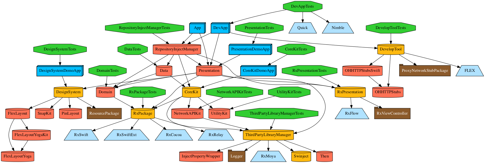

# Deepfine iOS Template

해당 프로젝트는 작성일 기준(2021.10.01) 최신 Xcode(13.0) 기준으로 작성하였습니다.

## 사용법

**1.**  [Tuist 설치](https://github.com/tuist/tuist) - 버전 1.50.0 이상

**2.**  [Carthage 설치](https://github.com/Carthage/Carthage) - 버전 0.38.0 이상  

**3.**  [Swiftlint 설치](https://github.com/realm/SwiftLint)

**4.**  `tuist dependencies`를 실행하여 XCFramework 생성

**5.**  RxBlocking, RxTest를 Test 타겟에서 사용하기 위해 `install_name_tool`을 이용하여 `@rpath/RxSwift.framework/RxSwift`를 `@rpath/ThirdPartyLibraryManager.framework/ThirdPartyLibraryManager`로 교체.

(RxSwift는 Dynamic Famework라서 해당 해당 작업을 해주지 않으면, rpath를 찾을 수 없음)
```
$ sh script/change-rpath-library.sh
```

**6.**  `tuist generate`를 실행하여 프로젝트 파일 생성
```
$ tuist generate
```

> 에러가 발생한 경우,<br>
> 해당 명령어 실행 후 다시 시도
```
$ tuist clean
```
<br>

## Dependency Graph

Tuist를 이용하여 Dependency Graph를 출력할 수 있음.

```
$ tuist graph # Graph 생성
$ tuist graph -t # 테스트 타겟 제외
$ tuist graph -d # 외부 라이브러리 제외
$ tuist graph -t -f dot # dot 파일로 출력
```


<br><br>

# TODO
* - [ ] **Localizable**
* - [ ] **DevOps**
    - [ ] **Fastlane**
    - [ ] **GitAction**

